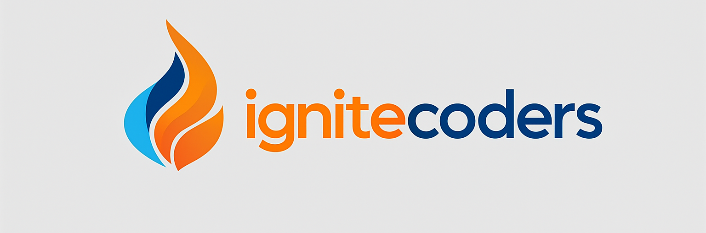

  

<h1 align="center">Hi there! I'm IgniteCoders 👋</h1>

  🧑‍💻 Mobile App Developer | 👨‍🏫 Programming Instructor | 🚀 Tech Explorer

  <em>"Turning ideas into apps, and code into learning."</em>

### 🛠️ Tech Stack

#### 📱 Android

  
  

#### 🍏 iOS

  
  

#### 🎮 Game Development

  

#### 🌐 Web & Backend

  
  
  
  
  

### 🚀 Featured Projects

- ✅ **[Task Hero](https://play.google.com/store/apps/details?id=com.ignite.todolist)** – Your ideal companion for an organized life
- 🎡 **[Roulettes](https://play.google.com/store/apps/details?id=com.ignite.roulette)** – Let chance guide your choice

---

### 📊 GitHub Stats

  
  

---

### 🕒 GitHub Activity Graph

  

---

### 📫 Let's connect

- 🌐 Website: [ignitecoders.dev](https://www.ignitecoders.dev/)
- 🧑‍💻 GitHub: [github.com/IgniteCoders](https://github.com/IgniteCoders)

---

  Thanks for stopping by! 🙌 Let's build something awesome together.

